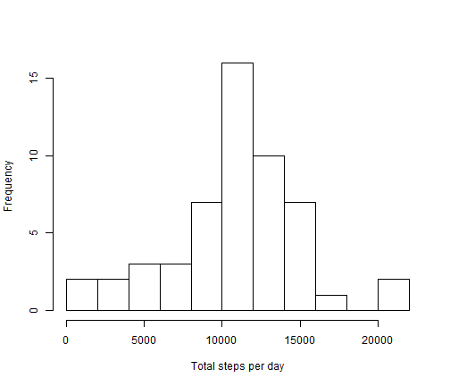
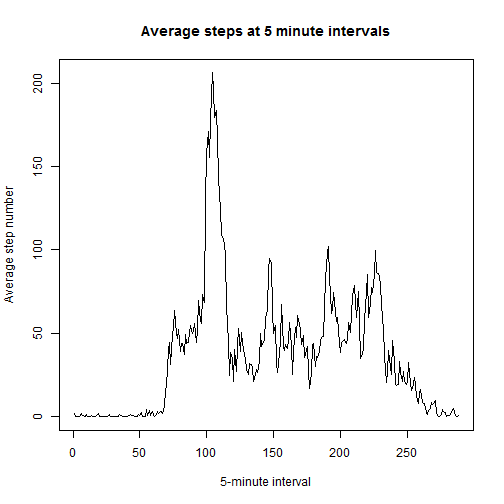
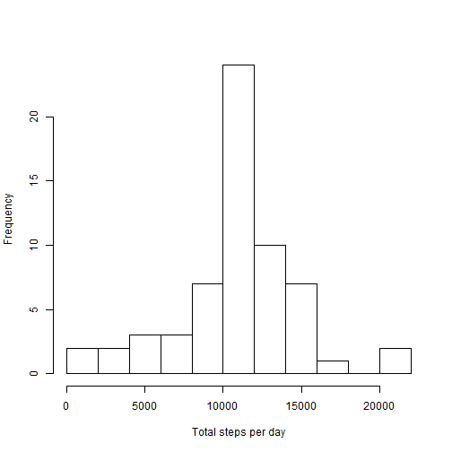
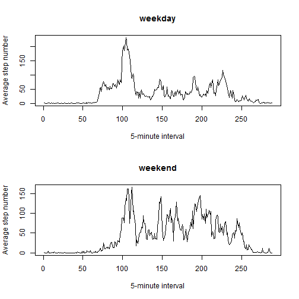

Activity Monitoring Data
==================================================
## Loading and preprocessing the data

* **Load the data:**


```r
activity = read.csv("activity.csv", header = T)
```

## What is mean total number of steps taken per day?

* **Make a histogram of the total number of steps taken each day:**


```r
Tstepday = tapply(activity$steps, activity$date, sum)
hist(Tstepday, breaks = 10, xlab = "Total steps per day", main = "")
```

 

* **Calculate and report the mean and median total number of steps taken per day:**

```r
mean(Tstepday, na.rm = T)
```

```
## [1] 10766
```

```r
median(Tstepday, na.rm = T)
```

```
## [1] 10765
```

## Which is the average daily activity pattern?

* **Make a time series plot (i.e. type = "l") of the 5-minute interval (x-axis) and the average number of steps taken, averaged across all days (y-axis):**


```r
Mstep = tapply(activity$steps, activity$interval, mean, na.rm = T)
plot(Mstep, type = "l", xlab = "5-minute interval", ylab = "Average step number", main = "Average steps at 5 minute intervals")
```

 

* **Which 5-minute interval, on average across all the days in the dataset, contains the maximum number of steps?**

```r
activity$interval[which.max(Mstep)]
```

```
## [1] 835
```
The 8:35 interval contains the maximum number of steps

## Imputing missing values

* **Calculate and report the total number of missing values in the dataset (i.e. the total number of rows with NAs):**

```r
sum(is.na(activity))
```

```
## [1] 2304
```
The total number of missing values is 2304

* **Devise a strategy for filling in all of the missing values in the dataset:**

The means of 5-minute interval will be used to fill the missing values at the corresponding intervals

* **Create a new dataset that is equal to the original dataset but with the missing data filled in:**

```r
newactivity = activity
for (i in 1:nrow(activity)) {
    if (is.na(activity$steps[i])){
        interval = activity$interval[i]
        RowNum = which(as.integer(attr(Mstep, "names")) == interval)
        newactivity$steps[i] = Mstep[[RowNum]]
    }
}
```

* **Make a histogram of the total number of steps taken each day and Calculate and report the mean and median total number of steps taken per day:**

```r
NewTstep = tapply(newactivity$steps, newactivity$date, sum)
hist(NewTstep, breaks = 10, xlab = "Total steps per day", main = "")
```

 

```r
mean(NewTstep)
```

```
## [1] 10766
```

```r
median(NewTstep)
```

```
## [1] 10766
```
mean did not change
median chanaged by 1 digit

## Are there differences in activity patterns between weekdays and weekends?

* **Create a new factor variable in the dataset with two levels - "weekday" and "weekend" indicating whether a given date is a weekday or weekend day:**

```r
Newdate = as.Date(newactivity$date, format = "%Y-%m-%d")
catDate = rep("weekday", nrow(newactivity))
for (i in 1:nrow(newactivity)){
    if(weekdays(Newdate[i]) == "Saturday" | weekdays(Newdate[i]) == "Sunday"){
        catDate[i] = "weekend"
    }
}

newactivity$catDate = as.factor(catDate)
```

* **Make a panel plot containing a time series plot (i.e. type = "l") of the 5-minute interval (x-axis) and the average number of steps taken, averaged across all weekday days or weekend days (y-axis):**

```r
newMstep = tapply(newactivity$steps, list(newactivity$catDate, newactivity$interval), mean)
par(mfrow = c(2,1))
plot(newMstep[1,], type = "l", xlab = "5-minute interval", ylab = "Average step number", main = "weekday")
plot(newMstep[2,], type = "l", xlab = "5-minute interval", ylab = "Average step number", main = "weekend")
```

 
